[](https://developer.android.com/jetpack/compose)
[](https://kotlinlang.org/)
[](https://android-arsenal.com/api?level=24)
[](https://docs.gradle.org/8.0/release-notes.html)
[](https://developer.android.com/jetpack/androidx/releases/paging)
[](https://developer.android.com/jetpack/androidx/releases/compose-material3)

# Platzi Code Challenge

## Requirements
The test consists of creating a simple app with two sections:
1. A list of items.
2. The detail of each item, which should have a lot of detail and make use of different components such as image, text, a vertical list, and whatever else you can think of.
   The idea is to use a public API from this list: https://github.com/public-apis/public-apis and implement the MVI or MVVM Clean architecture, as well as perform Unit Testing.

You should create a GitHub repository and share it with Alejandro Sanabria, @alesanabriav.

We will take into account the following tool skills:

- Declarative UI with Compose and state management with MVI.
- Use of coroutines.
- Offline First App.
- Dependency injection with Hilt.
- Multi-module project in Android.
- Use of Material 3 for UI.
- Paginated list with Paging 3.

---


## Solution
## API Selected

Since Platzi and I share a passion for knowledge and learning, I wanted to find an API related to either of them. I believe that incorporating a section of recommended books into the Platzi App could be useful. It wouldn't necessarily have to be an entire section, but rather a bibliography related to each course.

After some consideration, I decided to select the API from [Open Library](https://openlibrary.org/). This API provides information about books and their authors. However, it had some inconsistency problems in at least two different properties(This problem was fixed using a custom adapter, the 'InconsistentTypeAdapter').

[Api documentation](https://openlibrary.org/developers/api)

## Project structure

### Modules

 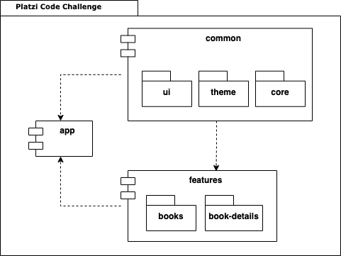

### Common
The ```common``` layer is responsible for common properties. It contains the implementations of the resources files, themes and components declared in the common layer.

- __ui__: This is responsible for common view components used in the app, and navigation routes.
  
- __core__: Defines some base implementations useful for any feature like base viewModel, network utils, etc.

- __theme__: Defines Material Theme(Colors, Typography and Dimens) based on Platzi colors.

### Features
The ```features``` layer contains the different features of the app in this case only two. Each feature consists of three layers : data, domain and presentation.

- __books__: It is the inital feature of the app. It has a list of books retrieved from the api of Open Library.
  
- __book-details__: This feature is very related to the previous. When you clicked some item in the book list, it navigates to this module where you will see some details about the selected book.


## MVI

Talking specifically about the features, the architecture used is a mix between the MVVM Clean(using the layers mentioned above: presentation, data and domain) and the Presentation Pattern MVI (Model View Intent)

The architecture used for the features, in high level, can be represented by the following diagram: 

 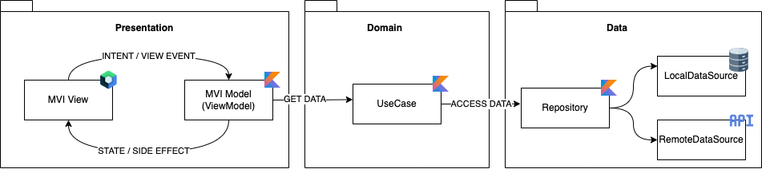


## Offline first
We know bad connection can't be an obstacle for learning, and for that reason, the app has support for Offline first behaviour. In every case, we use the local Database(Room) as the single source of truth, and only make requests in two situations:

- User requirement (Pull to refresh in book List)
- We don't have results to show (On scroll to new page of pagination, or when Book details were not saved in Database)

Each time a request is made, the data is saved on Room Database to be accesed from there.

### Book List - Offline first Logic (first load)

 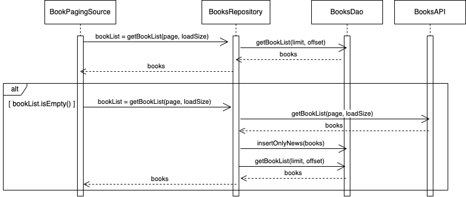

### Book Details - Offline first logic

 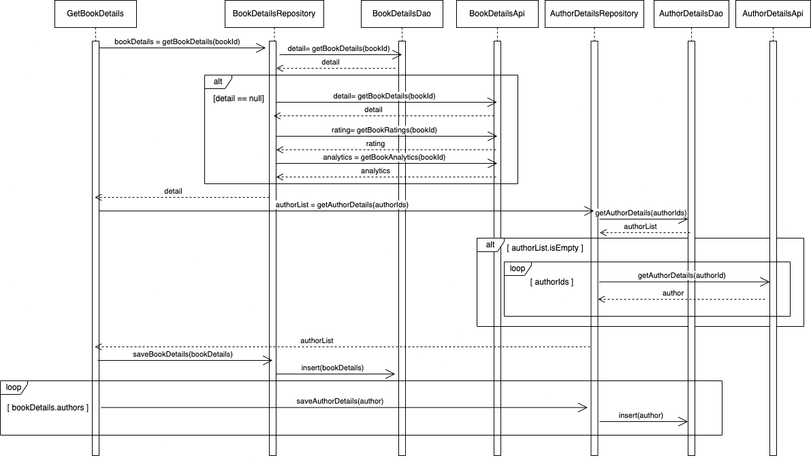


## Screens

| Icon app                                                   | Splash                                              |
|------------------------------------------------------------|-----------------------------------------------------|
| 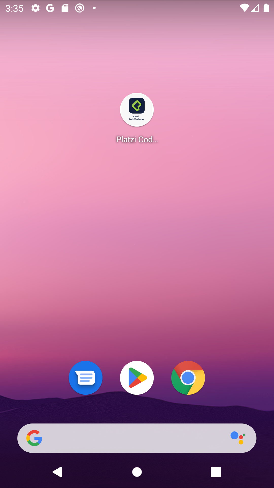 | 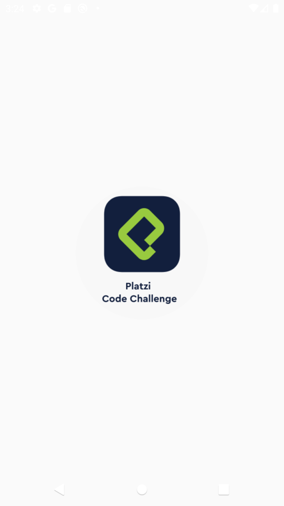 |


| Book List Refreshing/First load                                   | Book List Loading                                                     | Book List Loaded                                              |
|-------------------------------------------------------------------|-----------------------------------------------------------------------|---------------------------------------------------------------|
| 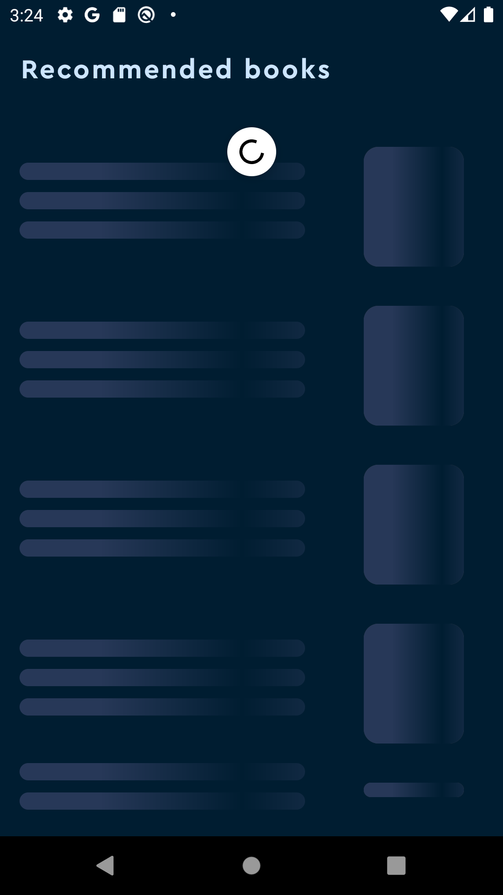 | 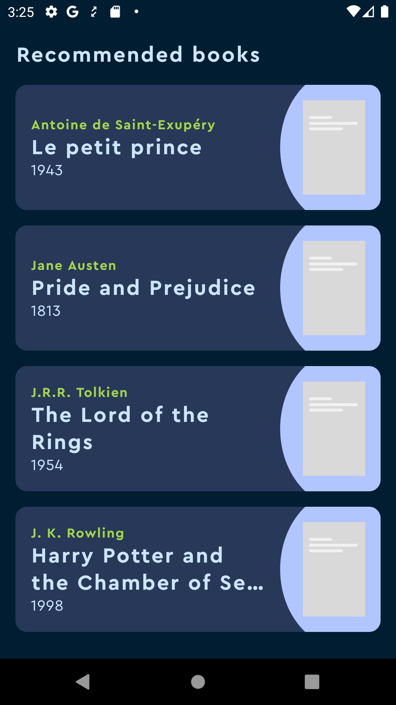 | 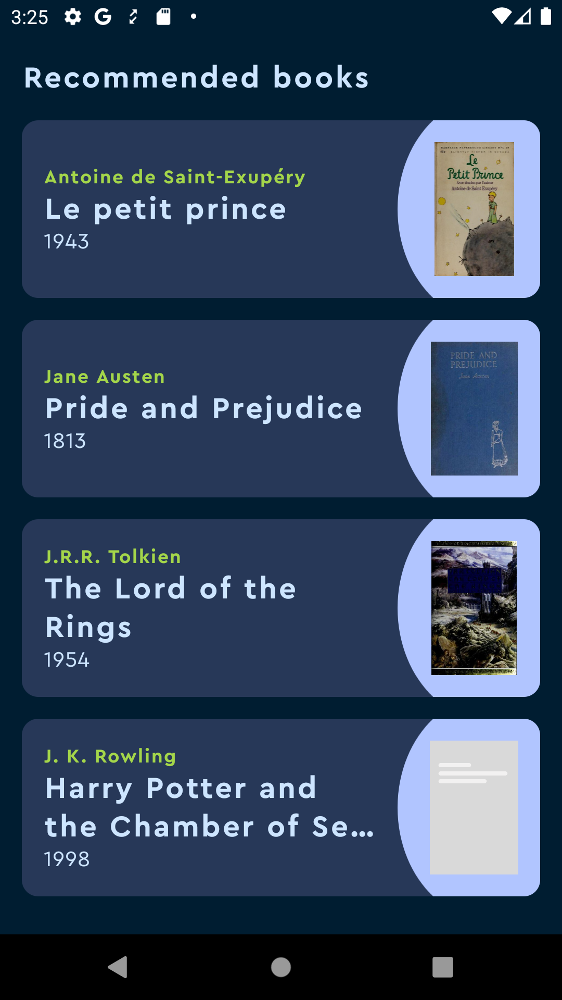 |


| Book Details Loading                                             | Book Details loaded                                             | Book Description                                                 |
|------------------------------------------------------------------|-----------------------------------------------------------------|------------------------------------------------------------------|
|  | 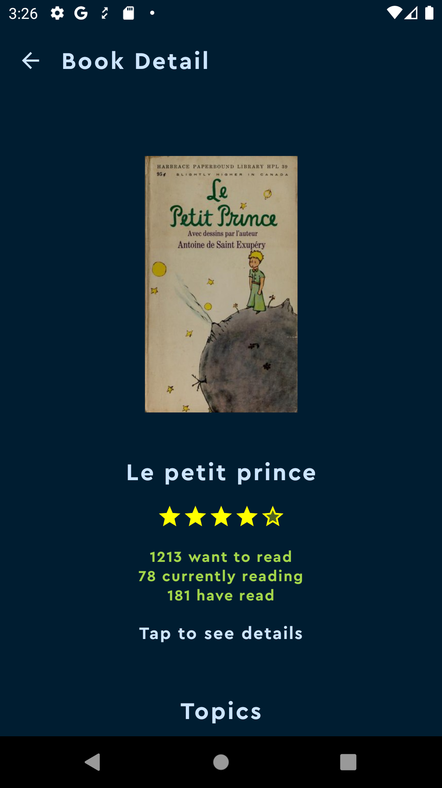 | 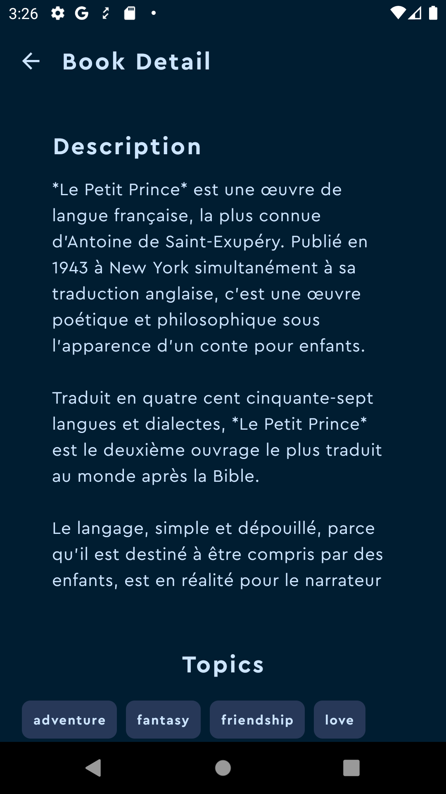 |

| Book Topics                                                 | Book Author                                                  | Book Multiple Authors                                                    |
|-------------------------------------------------------------|--------------------------------------------------------------|--------------------------------------------------------------------------|
| 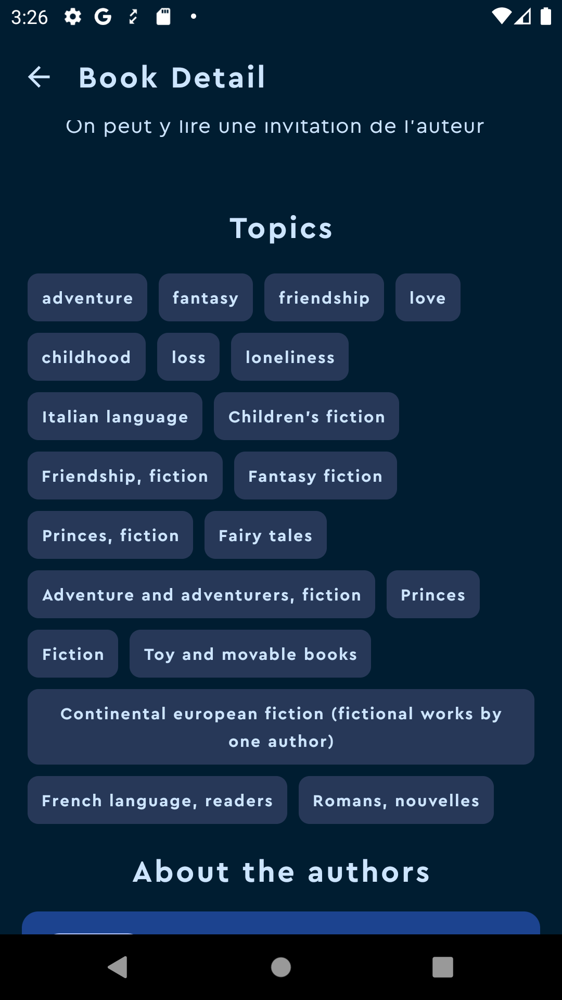 |  | 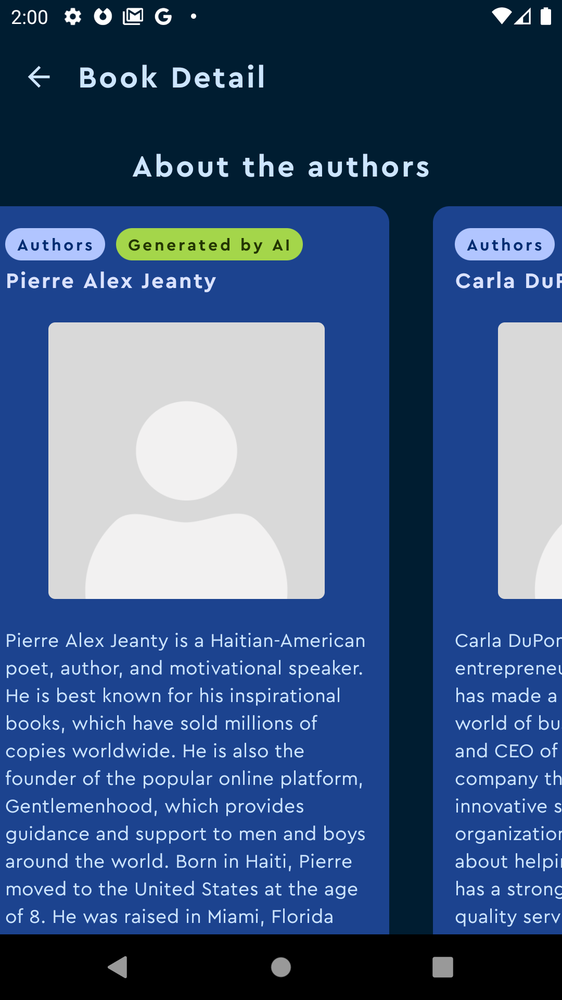 |


## Bonus! Using OpenAIApi to generate missing data

I noticed that certain authors and book descriptions were empty. So, why not use AI to generate them? 
The data load may be a little slower, but it's better than having an empty description, isn't it?
The generated results are labeled, making it easy for you to identify them.

| Book description by AI                                                    | Biographies by AI                                                        |
|---------------------------------------------------------------------------|--------------------------------------------------------------------------|
| 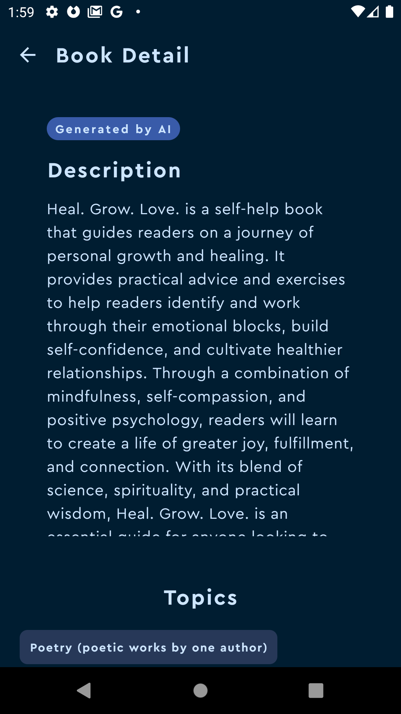 |  |

## Libraries used

- [Retrofit](https://square.github.io/retrofit/) - A type-safe HTTP client for Android and Java.
- [OkHttp](https://square.github.io/okhttp/) - An HTTP client for making network requests.
- [Moshi](https://github.com/square/moshi) - A modern JSON library for Kotlin and Java.
- [Hilt](https://dagger.dev/hilt/) - A dependency injection library for Android.
- [Room](https://developer.android.com/training/data-storage/room) - A persistence library for SQLite databases.
- [Paging 3](https://developer.android.com/topic/libraries/architecture/paging/v3-overview) - A library for gradually loading data in chunks from a data source.
- [Coil](https://coil-kt.github.io/coil/) - An image loading library for Android.
- [Jetpack Compose](https://developer.android.com/jetpack/compose) - A modern UI toolkit for building native Android apps.
- [MockK](https://mockk.io/) - A mocking library for Kotlin.
- [Turbine](https://github.com/cashapp/turbine) - A testing library for asynchronous code.
- [Truth](https://truth.dev/) - A fluent assertions library for Java and Kotlin.


## Running the Application

To run the application, follow these steps:

1. Ensure you have Android Studio installed on your machine.
2. Clone the repository to your local machine using the following command:
   ```
   git clone https://github.com/joniaranguri/platzi-android-challenge
   ```
3. Open Android Studio and select "Open an existing Android Studio project".
4. Navigate to the cloned repository directory and select the project.
5. Build the project by clicking on the "Build" option in the menu bar and selecting "Make Project".
6. Connect an Android device or start an emulator.
7. Click on the "Run" button in the toolbar or select "Run > Run 'app'" from the menu bar.
8. Choose the target device or emulator and click "OK".
9. The application will be installed and launched on the selected device or emulator.

## About me
[Jonathan Aranguri](https://www.linkedin.com/in/jonathan-aranguri/)

